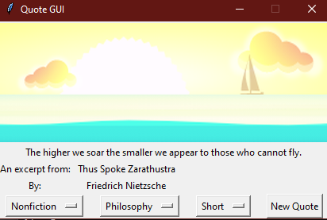

# quote-gui

A GUI for displaying quotes from books on Amazon.

Quotes are taken from the same API as https://www.how-to-type.com/typing-practice/quote/

# Install

pip install git+https://github.com/brendoser/quote-gui#egg=quote-gui 

Notes:
- Python >= 3.8 required

# Run 

quote-gui

Notes:
- Enter in terminal/command prompt to run

